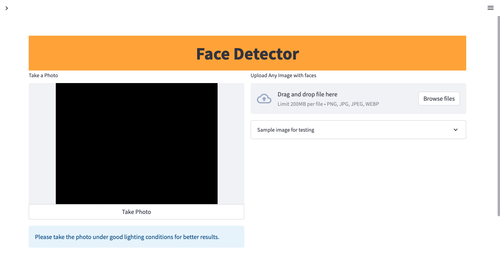
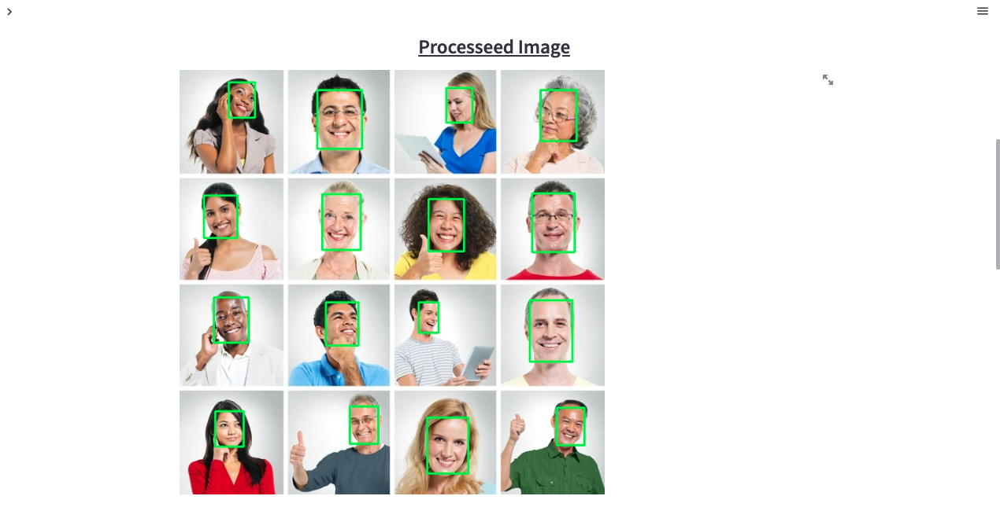
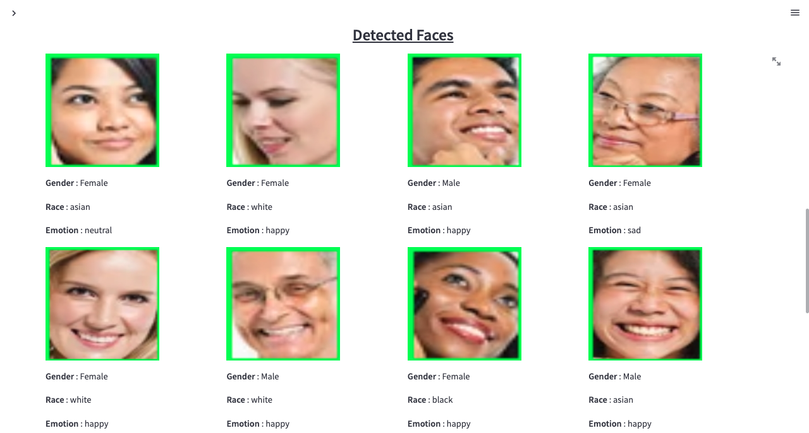
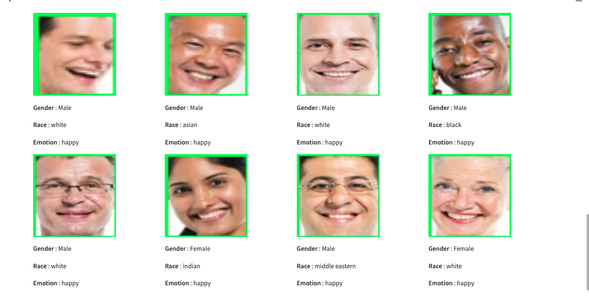

# Face Detector with Gender Recognition and Emotion Classification using MTCNN and Deepface.
[Click here to got to Web App](https://nagasai524-facedetector-with-genderrecogni-face-detector-011ib0.streamlit.app/)  
I have created a web application that detects all the faces present in the image and finds out the gender and emotion of every detected face. I have used state of the art techniques like **MTCNN** for face detection. 
For facial attribute analysis, I have used **Deepface** library is a hybrid face recognition framework wrapping state-of-the-art models: **VGG-Face, Google FaceNet, OpenFace, Facebook DeepFace, DeepID, ArcFace and Dlib**. These models already reached and passed human level accuracy.
# Input
You can either take your live photo or upload any existing image with faces. I have already provided an image with multiple faces for quick testing.

# Output
The processed version of the input image in which every detected face is marked with a bounding box will be displayed. 

The detected faces in the input image are cropped and facial attribute analysis is performed for all of them. Each cropped face along with its attributes such as Gender, race and emotion are displayed at the bottom of every detected face.

